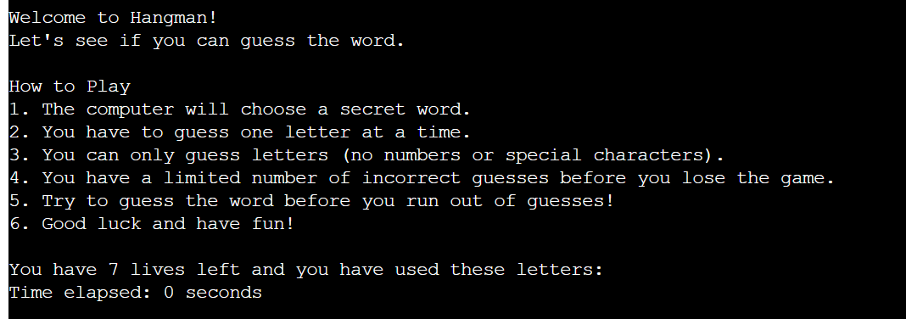
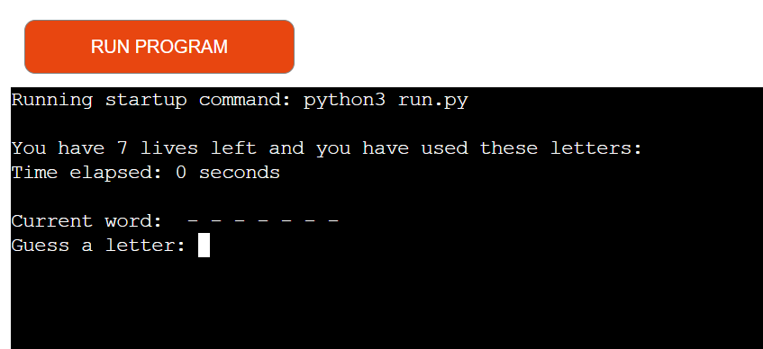
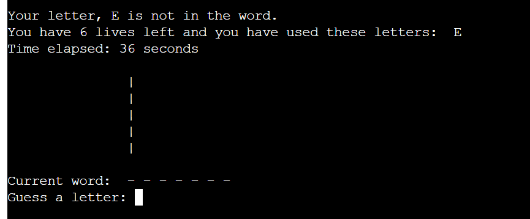
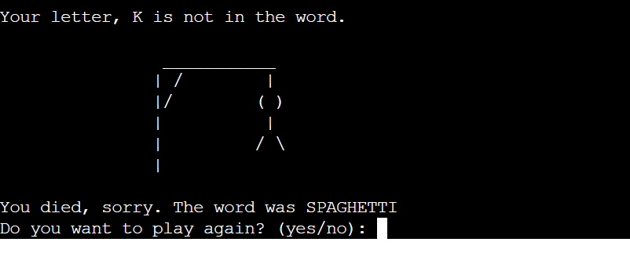
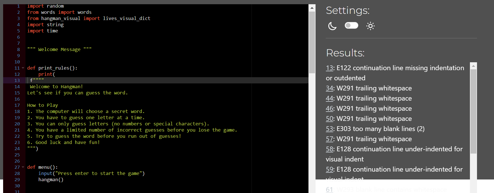
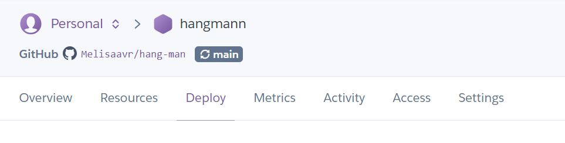
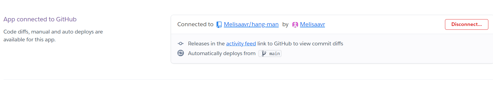
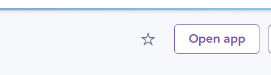
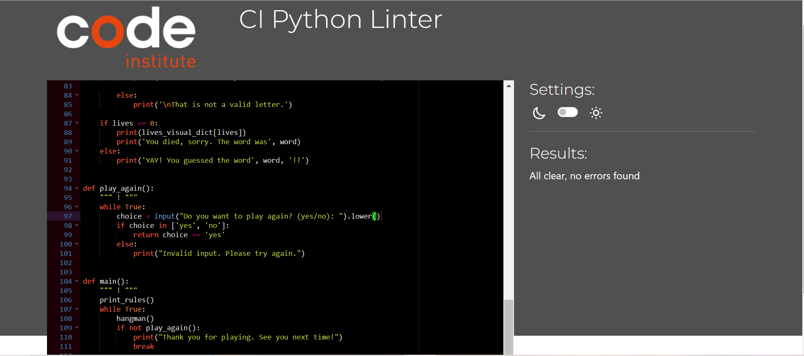

# HANG-MAN
Hang-man is a word-guessing game with a timer to track your progress and how long it will take for you to win or lose. 
It is very straightforward and easy to play. It allows you to visually see how far you have come whether its a win and the letters are displayed, or, the hang-man is visually developed as you guess the wrong letters. 
Link to hang-man https://hangmann-461bf35a6e08.herokuapp.com/

## HOW TO PLAY
1. The computer will choose a secret word.
2. You have to guess one letter at a time.
3. You can only guess letters (no numbers or special characters).
4. You have a limited number of incorrect guesses before you lose the game.
5. Try to guess the word before you run out of guesses!
6. Good luck and have fun!

## USER STORIES
- As a first time user, I want to understand the game so I can begin guessing straight away. 
- As a first time user, I want to cover the rules so I am aware of how many times I can try before I lose. 

As a frequent visitor, I want to be able to challenge myself with new words to guess. 

## FEATURES
- Welcome and How to play: 

The game starts by prompting you that you have 7 lives, which is exciting since you do not know what will come your way. It shows you how many letters are in the word and allows you to make your first guess

- There is a timer going on and it times how long it takes for the user to finish the game. There is a feature to warn the user if the letter they have picked is right/wrong and how many lives they have left. You can also see the hangman forming everytime the user gets a letter wrong. 

- When the user wins, there is a text telling them so. They then can choose if they want to play again or quit by answering yes or no. 

- The user is notified that they have no more lives left and the hangman is fully formed to support the text. They can again choose to play or quit the next round. 

## FLOWCHART
The flowchart represents the logic that has been followed: 

## TECHNOLOGIES USED
### Languages
Python 3.8.5: used to anchor the project and direct all application behavior

### Built in Packages
- random  -  Python Random module is an in-built module of Python that is used to generate random numbers in Python. These are pseudo-random numbers means they are not truly random. This module can be used to perform random actions such as generating random numbers, printing random a value for a list or string, etc.
- string - The built-in string class provides the ability to do complex variable substitutions and value formatting
- time - the time module is another built-in way to get the current time in Python. 

### Other Tools
- VSCode was used as the main tool to write and edit code.
- GitHub was used to host the code of the website.
- Heroku used to deploy the code.
## Bugs
- ***Bug:*** The lines were too long so I have made sure they were shorter than 79. 
- ***Fix:*** I have resolved the lines being too long and fixed the blank lines too. 

- ***Bug:*** Previously, the game did not handle non-alphabetical characters properly. If a user inputted a number or special character, it would prompt them to guess another letter but did not remove the invalid character from the input buffer, causing potential confusion.
- ***Fix:*** Added validation to reject non-alphabetical characters and prompt the user to enter a valid letter without counting it as an attempt.
- ***Bug:*** The timer displaying the elapsed time was not paused when the game was waiting for user input, potentially leading to inaccurate elapsed time display.
- ***Fix:*** Adjusted the timer to only track active gameplay time, pausing when waiting for user input to ensure accurate elapsed time display.

### Mistakes: 
- I am aware that I was making a mistake with my commit messages so for my resubmission I have tried my best to use the correct form of commit messages. 

## Deployment
- The program was deployed to Heroku.
- This project requires you to have Python installed on your local PC.

- Create a local copy of the GitHub repository by following one of the two processes below:

- Clone the repository:

- Open a folder on your computer with the terminal.
- Run the following command
git clone https://github.com/Melisaavr/hang-man.git
- Create your own GitHub repository to host the code.

- Run the command git remote set-url origin <Your GitHub Repo Path> to set the remote repository location to your repository.

- Push the files to your repository with the following command: git push

- Create a Heroku account if you don't already have one here Heroku.

- Create a new Heroku application on the following page here New Heroku App:

- Create a new Heroku application

- Go to the Deploy tab:

- Link your GitHub account and connect the application to the repository you created.

- Go to the Settings tab:

- Click "Add buildpack":

- Add the Python and Node.js buildpacks in the following order:

- Click "Reveal Config Vars."

- Add 1 new Config Vars:

Key: PORT Value: 8000
This Config was provided by CODE INSTITUTE.

- Go back to the Deploy tab:

- Click "Deploy Branch":

- Wait for the completion of the deployment.

- Click "Open app" to launch the application inside a web page.

## Testing
### CI PYTHON LINTER: No errors were left unresolved. 

### Manual Testing: 

| action | expected result | tested | passed | comments |
| --- | --- | --- | --- | --- |
| The welcome message and game rules should be displayed correctly.| Welcome message and rules displayed| Y | Y | - |
| Testing Game Start| The game should start after pressing enter.| Y | Y | - |
|Testing Valid Input| The game should accept valid letters and update the game state accordingly.| Y | Y | - |
| Testing Invalid Input Handling| The game should reject non-alphabetical characters and not count them as attempts.| Y | Y | - |
| Testing Repeated Letters| The game should notify the user if a letter has already been guessed and not count it as a new attempt.| Y | Y | - |
| Testing Timer Accuracy| The elapsed time should only account for active gameplay and not include waiting periods.| Y | Y | - |
|Testing Game Over Conditions| The game should end when the player either correctly guesses the word or runs out of lives.| Y | Y | - |
| Testing Play Again Functionality| The game should prompt the user to play again and restart if the user chooses to do so.| Y | Y | - |

## Credits
How to add a timer on Python https://www.youtube.com/watch?v=KseiSR0MCTI&ab_channel=BroCode

