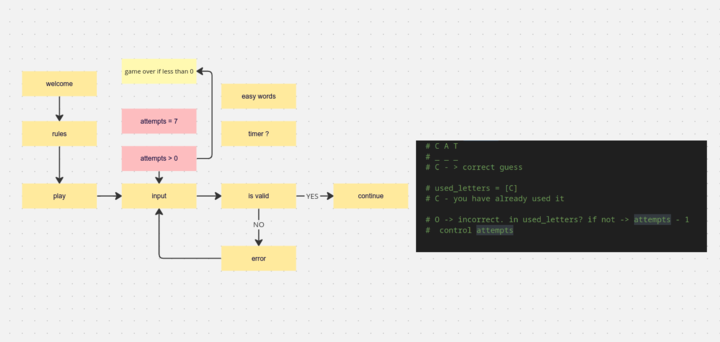

# HANG-MAN
Hang-man is a word-guessing game with a timer to track your progress and how long it will take for you to win or lose. 
It is very straightforward and easy to play. It allows you to visually see how far you have come whether its a win and the letters are displayed, or, the hang-man is visually developed as you guess the wrong letters. 
Link to hang-man https://hangmann-461bf35a6e08.herokuapp.com/

## HOW TO PLAY
1. The computer will choose a secret word.
2. You have to guess one letter at a time.
3. You can only guess letters (no numbers or special characters).
4. You have a limited number of incorrect guesses before you lose the game.
5. Try to guess the word before you run out of guesses!
6. Good luck and have fun!

## USER STORIES
As a first time user, I want to understand the game so I can begin guessing straight away. 
As a first time user, I want to cover the rules so I am aware of how many times I can try before I lose. 

As a frequent visitor, I want to be able to challenge myself with new words to guess. 

## FEATURES
Welcome and How to play: 

The game starts by prompting you that you have 7 lives, which is exciting since you do not know what will come your way. It shows you how many letters are in the word and allows you to make your first guess

There is a timer going on and it times how long it takes for the user to finish the game. There is a feature to warn the user if the letter they have picked is right/wrong and how many lives they have left. You can also see the hangman forming everytime the user gets a letter wrong. 

When the user wins, there is a text telling them so. They then can choose if they want to play again or quit by answering yes or no. 

The user is notified that they have no more lives left and the hangman is fully formed to support the text. They can again choose to play or quit the next round. 

## FLOWCHART
The flowchart represents the logic that has been followed: 

## TECHNOLOGIES USED
### Languages
Python 3.8.5: used to anchor the project and direct all application behavior

### Built in Packages
random  -  Python Random module is an in-built module of Python that is used to generate random numbers in Python. These are pseudo-random numbers means they are not truly random. This module can be used to perform random actions such as generating random numbers, printing random a value for a list or string, etc.
string - The built-in string class provides the ability to do complex variable substitutions and value formatting
time - the time module is another built-in way to get the current time in Python. 

### Other Tools
VSCode was used as the main tool to write and edit code.
GitHub was used to host the code of the website.

## Bugs

